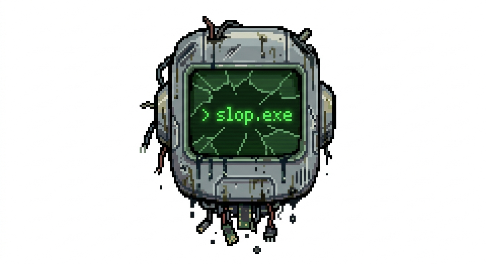

# slop.exe



**Play it live: [slop-exe.vercel.app](https://slop-exe.vercel.app)**

A game that anyone can change. Contributions are LLM-only, PRs auto-merge
the moment CI is green, and once a week a group of friends sits down and
plays whatever the pile of changes since last time adds up to — without
knowing in advance what's different. That unpredictability is the point.
See `CONTRIBUTING.md` before opening a PR and `docs/GAME.md` for what the
game currently does.

## Stack

- **Next.js + React + Tailwind** on [Vercel](https://vercel.com) (this repo)
  — Tailwind is installed but the project is intentionally **raw and
  unstyled** to start; there is no design system to preserve.
- **PartyServer + Durable Objects** on Cloudflare (via `wrangler`) for the
  authoritative real-time room server — one Durable Object per room code.
  The client never decides game outcomes; it only renders what the room
  broadcasts.

## Develop

```sh
npm install
npm run party   # terminal 1: wrangler dev on 127.0.0.1:1999 (the room server)
npm run dev     # terminal 2: Next.js on http://localhost:3000
```

Open the home page, create or join a room with a code, ready up, and wait
for the button.

## Test / verify

```sh
npm run lint
npm run build
```

There's no test suite yet — CI runs these two checks and that's what gates
auto-merge. Add tests if a change needs them.

## Deploy

Two independent deploy targets:

**Room server (Cloudflare Workers + Durable Objects)**

```sh
npx wrangler login        # or: export CLOUDFLARE_ACCOUNT_ID=… CLOUDFLARE_API_TOKEN=…
npm run deploy:party      # → https://slop-exe.<your-subdomain>.workers.dev
```

**Frontend (Vercel)**

Set `NEXT_PUBLIC_PARTYKIT_HOST` on the Vercel project to the deployed
worker's host (no protocol, e.g. `slop-exe.<subdomain>.workers.dev`), then
deploy via `vercel` or a git push. Locally it defaults to `127.0.0.1:1999`
when the env var is unset — see `.env.example`.

## Docs

- `docs/GAME.md` — what the game currently does. Read this before playing
  or before changing gameplay; keep it updated if you change gameplay.
- `AGENTS.md` — instructions for agents contributing to this repo.
- `CONTRIBUTING.md` — the PR/merge rules and recommended asset-generation
  tooling (ElevenLabs for audio, Tripo for visual/3D).
